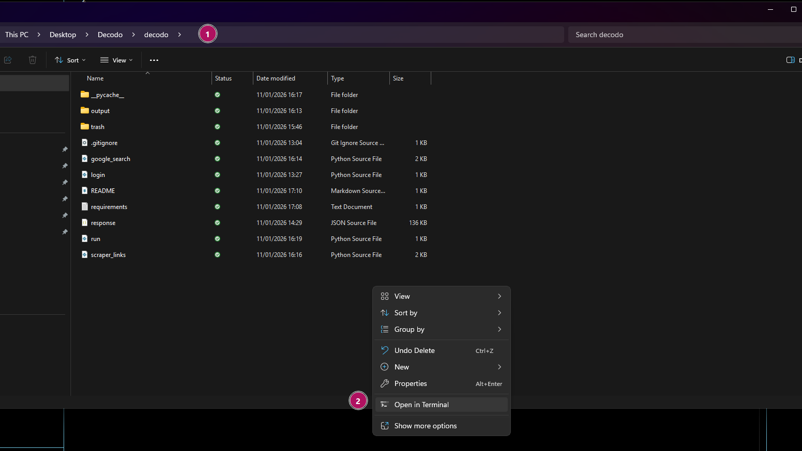

# Decodo Google Scraper

CLI App skirtas naudodis Decodo

## Bendri reikalavimai
- Python 3.10 arba daugiau
- GIT instaliacijos
- Autentifikacijos Decodo

## Python Install

Atsisiunčiame python iš:
https://www.python.org/downloads/

Instaliuojant pažymėti:
Add Python to PATH

## Check version (optional)

Terminale paleidžiame komanda (Terminalo įjungimas žemiau):

```bash
python --version
```

## GIT instaliavimas

GIT instaliuojame iš:
https://git-scm.com/install/

po instaliavimo patikriname versija

```bash
git --version
```

## Terminalo atidarymas

Atidarome terminala folderyje, kur gulės projektas.
Prieš tai galime pasidaryti tuščia folderį skrita projekto failams



## Klonuojame GIT repozitoriją

```bash
git clone https://github.com/Polonez1/decodo
```

## Instaliuojame bibliotekas

```bash
pip install -r requirements.txt
```

## Autentifikacija

Sukuriame failą login.py terminale paleidžiant:

```bash
New-Item login.py -ItemType File
```

Vėliau atidarome per notepad arba įrašome į terminalą:

```bash
notepad login.py
```

Atsidaro notepad ir įklijuojame:

```bash
token = 'YOU_AUTH_TOKEN'
```

kur vietoje YOU_AUTH_TOKEN paduodame savo tokeną.

## Paleidžiame apps'ą

Terminale įrašome komandą:
```bash
python run.py --search_by homeopatija --page_from 1 --page_count 10
```

## Projekto stkrūktura:

decodo/
├── output/ 
│ ├── excel_output/ # failai kurie bus paduodami GPT
│ │ ├── data_homeopatija_1_1.xlsx
│ │ └── data_homeopatija_1_10.xlsx
│ └── google_output/ # tai, ką gauname iš google search
│ ├── response_homeopatija_1_1.json
│ └── response_homeopatija_1_10.json
├── readme_data/ 
│ └── Terminal.png # Kaip rasti terminalą
├── google_search.py 
├── scraper_links.py 
├── login.py # Failas, kuris reikalingas autentifikacijai
├── requirements.txt # Naudojamos bibliotekos
├── run.py # Paleidimas
└── README.md # Dokumentacija